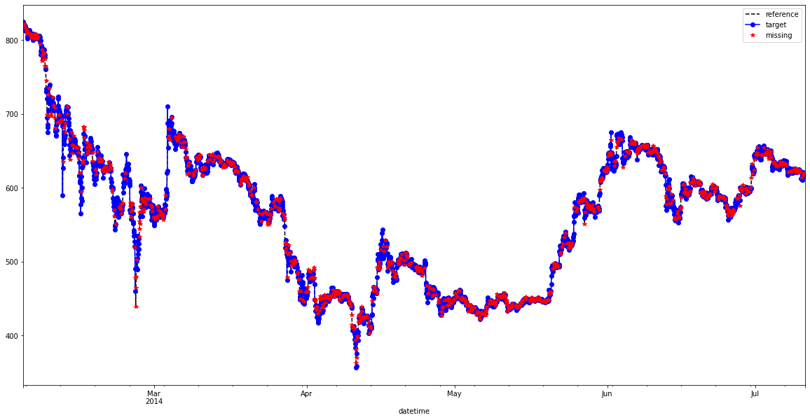

# Interpolation Study to Handle Missing Data on BTC dataset :chart_with_upwards_trend:

Time series are an important form of indexed data found specially in stocks data. Due to its time dependency, time series are subject to have missing points due to problems in reading or recording the data.

To apply machine learning models effectively, the time series has to be continuous, as most of the ML models are not designed to deal with missing values. Hence, the rows with missing data should be either dropped or filled with appropriate values.

To prove this assumption, let’s take an example and solve it in python.

I generated an OHLCV candle dataset from a bitcoin exchange.

I took a small range without NaN and randomly added a percentage of it.

**I then tried various interpolation techniques in order to see: as the percentage of NaN varies, which interpolation method is the best in the case of stocks data**.

#### **References**
Thanks to *Dr Mohammad El-Nesr* and his work [here](https://drnesr.medium.com/filling-gaps-of-a-time-series-using-python-d4bfddd8c460).
